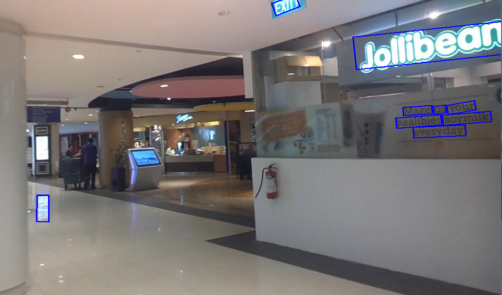

# RRPN_pytorch
RRPN in pytorch, which is implemented under framework of facebook's benchmark: https://github.com/facebookresearch/maskrcnn-benchmark. 
Its caffe version can be viewed at: https://github.com/mjq11302010044/RRPN.



## Highlights
- **From original repo:** In pytorch 1.0, Somehow faster than original repo in both training and inference.
- **Training and evaluation checked:** Testing in IC15 with training data in {IC13, IC15, IC17mlt}, and receives Fscore of 83% vs. 81% in caffe repo.
- **What's new:** RRoI Pooling is replaced with RRoI Alignment(bilinear interpolation for sampling), FPN structure supported, easy to change various backbones for different purposes.

## Installation

Check [INSTALL.md](INSTALL.md) for installation instructions.

## Configuring your dataset
- Your dataset path can be set in `$RRPN_ROOT/maskrcnn_benchmark/config/paths_catalog.py`. We implemented interface for {IC13, IC15, IC17mlt, LSVT, ArT} for common use(Start from line 96):
```bash
...
 "RRPN_train": {  # including IC13 and IC15
            'dataset_list':{
                # 'IC13': 'Your dataset path',
                ...
            },
            "split": 'train'
        },
...
```
- Add your dataset?
You need to form a dict array as follows:
```bash
im_info = {
    'gt_classes': your class_id array,
    'max_classes': your class_id array,
    'image': path to access one image,
    'boxes': rotate box in {cx, cy, w, h, θ},
    'flipped': Not supported, just False, 
    'gt_overlaps': overlaps fill with 1 (gt with gt),
    'seg_areas': H * W for an rbox,
    'height': height of an image,
    'width': width of an image,
    'max_overlaps': overlaps fill with 1 (gt with gt),
    'rotated': just True
}
```
Examples can be seen in `$RRPN_ROOT/maskrcnn_benchmark/data/rotation_series.py`
Your data API should be add to the variable `DATASET`:
```bash
DATASET = {
    'IC13':get_ICDAR2013,
    'IC15':get_ICDAR2015_RRC_PICK_TRAIN,
    'IC17mlt':get_ICDAR2017_mlt,
    ...
    'Your Dataset Name': 'Your Dataset API'
}
```

## Training 
```bash
# create your data cache directory
mkdir data_cache
```
```bash
# In your root of RRPN
python tools/train_net.py --config-file=configs/rrpn/e2e_rrpn_R_50_C4_1x_ICDAR13_15_17_trial.yaml
```
- Multi-GPU phase is not testing yet, be careful to use GPU more than 1.

## Testing
- Using `$RRPN_ROOT/demo/RRPN_Demo.py` to test images you want. The demo will generate a text for your detected coodinates.
- Showing the detected image by ture the variable `vis` to True.

## Final 
- Enjoy it with all the codes.
- Citing us if you find it work in your projects.
```
@misc{ma2019rrpn,
    author = {Jianqi Ma},
    title = {{RRPN in pytorch}},
    year = {2019},
    howpublished = {\url{https://github.com/mjq11302010044/RRPN_pytorch}},
}
@article{Jianqi17RRPN,
    Author = {Jianqi Ma and Weiyuan Shao and Hao Ye and Li Wang and Hong Wang and Yingbin Zheng and Xiangyang Xue},
    Title = {Arbitrary-Oriented Scene Text Detection via Rotation Proposals},
    journal = {IEEE Transactions on Multimedia},
    volume={20}, 
    number={11}, 
    pages={3111-3122}, 
    year={2018}
}
```
